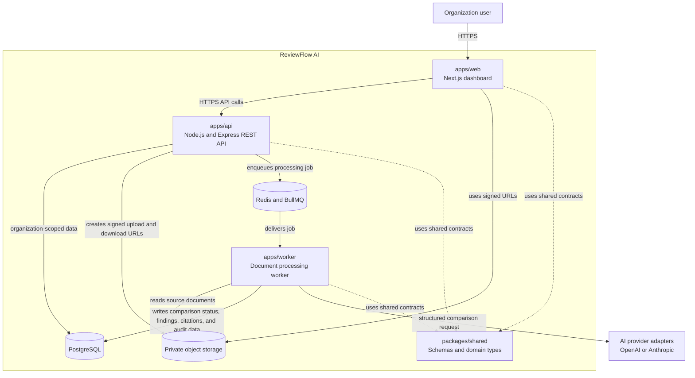
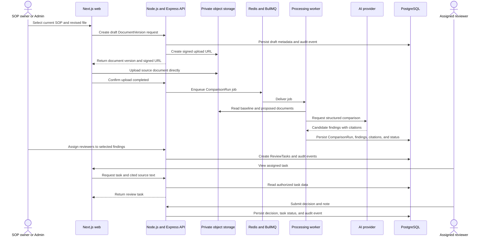
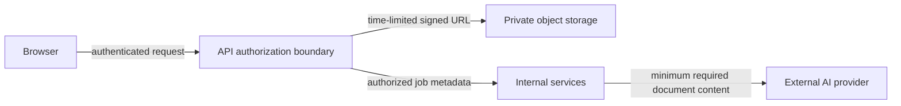

# ReviewFlow AI — Proposed Architecture

**Status:** Proposed — Phase 0 architecture baseline  
**Last updated:** 2026-07-21  
**Scope:** V1 review workflow for Vendor Onboarding SOP revisions

> This is a container-level target architecture, not a final implementation design. It records the current hypothesis so it can be validated by an end-to-end vertical slice and revised through Architecture Decision Records (ADRs).

## 1. Architectural goals

1. Keep organization data isolated in a multi-tenant SaaS model.
2. Keep document upload and AI comparison asynchronous so slow or failing work does not block HTTP requests.
3. Require a human reviewer to make approval decisions; AI produces evidence-backed candidate findings only.
4. Preserve document versions, citations, review decisions, and audit history.
5. Keep uploaded documents private and avoid exposing storage credentials to browsers.
6. Allow AI providers and document-processing implementation details to evolve without rewriting the API or review workflow.

## 2. Scope and non-goals

### V1 scope

- Vendor Onboarding SOP version upload and comparison
- Background document extraction and comparison
- Candidate change findings with source citations
- One review task per reviewable change finding
- Human review decisions and audit events
- Organization-scoped authorization

### Deferred from V1

- Google Drive import and Slack notifications
- Automatic reviewer routing
- Contract-management, RFP-management, or vendor-master workflows
- Real-time collaboration and live presence
- A final production cloud provider or deployment topology
- Production AI provider selection, fallback policy, and embeddings strategy

## 3. System context and container diagram



## 4. Container responsibilities

| Container | Responsibility | Must not be responsible for |
| --- | --- | --- |
| `apps/web` | Presents dashboard, upload, comparison, and review experiences; calls the API; uploads/downloads files through signed URLs. | Direct database access, queue consumption, AI decisions, or permanent authorization enforcement. |
| `apps/api` | Authentication, organization authorization, document/version metadata, signed URL creation, review-task APIs, audit-event creation, and job enqueueing. | Long-running extraction or AI comparison inside an HTTP request. |
| `apps/worker` | Reads queued jobs, extracts content, runs comparison, validates structured AI output, persists findings/citations, and handles bounded retries. | Browser-facing authentication flows or user-interface rendering. |
| PostgreSQL | System of record for tenant data, document metadata, versions, comparisons, findings, tasks, decisions, and audit events. Application services access it through Prisma. | Storing full uploaded source files or substituting for tenant authorization. |
| Private object storage | Stores original uploaded files and derived artifacts that do not belong in relational rows. | Authorizing a user without an API-generated signed URL. |
| Redis / BullMQ | Durable background-job coordination, retry scheduling, and worker delivery. | The permanent system of record for document or review state. |
| `packages/shared` | Shared Zod schemas, domain types, and stable contracts used by web, API, and worker. | Framework-specific UI or service logic. |
| AI provider adapters | Produces structured candidate findings from extracted document content. | Final policy approval or direct database writes. |

## 5. Primary workflow: upload, compare, and review



## 6. Trust boundaries and data ownership



### Security principles

| Boundary | Principle |
| --- | --- |
| Browser → API | The API verifies short-lived JWTs and active refresh-session state, then authorizes every organization-scoped action. |
| Browser → storage | Browsers use short-lived signed URLs; storage remains private. |
| API/worker → database | Every organization-owned query must be scoped by organization identity. |
| API → queue | Jobs carry identifiers and safe metadata, not trusted client authorization. |
| Worker → AI provider | Send only content required for the comparison; record provider/model metadata and failures. |
| Human review | AI findings are advisory. A human decision is required before a document version becomes approved. |

## 7. Data ownership and lifecycle

| Data | System of record | Notes |
| --- | --- | --- |
| Organizations, users, memberships | PostgreSQL | Defines tenant access and application roles. |
| Password credentials and RefreshSessions | PostgreSQL | Stores Argon2id password hashes and hashed, rotating refresh-session tokens; never raw refresh tokens. |\n| Documents and DocumentVersions | PostgreSQL | Version metadata and lifecycle state; source files live in object storage. |
| Source files and derived artifacts | Private object storage | Never publicly list or expose objects. |
| ComparisonRuns, ChangeFindings, and SourceCitations | PostgreSQL | Enables cited review, retry history, and future evaluation. |
| ReviewTasks, ReviewDecisions, and Comments | PostgreSQL | Supports individual review workflow and filtering. |
| AuditEvents | PostgreSQL | Append-only history of meaningful actions. |
| Queue jobs | Redis / BullMQ | Transient processing coordination, not canonical business state. |

## 8. Reliability and failure model

### Document-processing states

```text
Draft → Queued → Processing → Ready for Review
                         ↘ Failed → authorized retry → Queued
```

### Reliability principles

- The API returns promptly after recording a version and enqueueing its work.
- A worker retry must be idempotent: retrying a `ComparisonRun` must not duplicate findings or review tasks.
- Job failure stores a useful failure reason against the related version/run.
- A failed comparison cannot be published or assigned for review.
- Human decisions and audit events remain durable even if queues or providers are temporarily unavailable.
- Queue, provider, and storage failures require observable status rather than silent failure.

## 9. Key architectural constraints

| Constraint | Architectural response |
| --- | --- |
| Long-running extraction and AI calls | Separate worker and queue from the HTTP API. |
| Multi-tenant data | Organization-scoped access checks in API and service layers; tenant ownership in the data model. |
| Source-grounded review | Persist citations linked to baseline and proposed versions. |
| Human accountability | AI produces `ChangeFinding` candidates; reviewers create decisions. |
| Individual review workflow | One `ReviewTask` per reviewable `ChangeFinding`; task status supports filtering. |
| Private documents | Private storage plus signed URLs rather than public object URLs. |\n| Authentication lifecycle | Short-lived JWT access tokens, rotating server-side refresh sessions, and current Membership/task authorization checks. |
| Future provider changes | Provider adapters behind a stable structured-output contract. |

## 10. Assumptions and validation triggers

| Assumption | What will validate or challenge it |
| --- | --- |
| A queue and worker are justified. | Build a comparison flow with realistic sample SOPs and measure request duration, retries, and failure handling. |
| One task per finding is usable. | Test reviewer workload using the V1/V2 sample documents and evaluate task volume. |
| Source citations make findings reviewable. | Ask reviewers whether excerpts contain enough context to make a decision. |
| PostgreSQL is sufficient as the system of record. | Validate query patterns, tenant-scoping needs, and future vector-search requirements. |
| AI providers can return useful structured findings. | Build an evaluation set from expected material changes and measure citation completeness and false positives. |
| The API should remain REST-first. | Revisit if real-time collaboration or client data-fetching requirements make another interface necessary. |

## 11. Deferred architecture decisions

These are intentionally not decided yet:

- Production hosting provider and network topology
- OAuth/social login, enterprise SSO, MFA, passkeys, and email-verification/password-reset providers
- Prisma model conventions, migration workflow, and exact tenant-isolation implementation
- Exact object-storage provider and local-development emulator
- AI provider, prompt strategy, fallback behavior, model version, and cost limits
- pgvector and embeddings design
- Notifications, integrations, and webhooks
- Observability vendor and telemetry schema

## 12. Review cadence

This document should be revisited after:

1. the first end-to-end upload-to-review vertical slice;
2. the first background-job retry/failure test;
3. the first structured AI comparison evaluation;
4. a decision to add a second document domain;
5. any ADR that supersedes a decision represented here.
