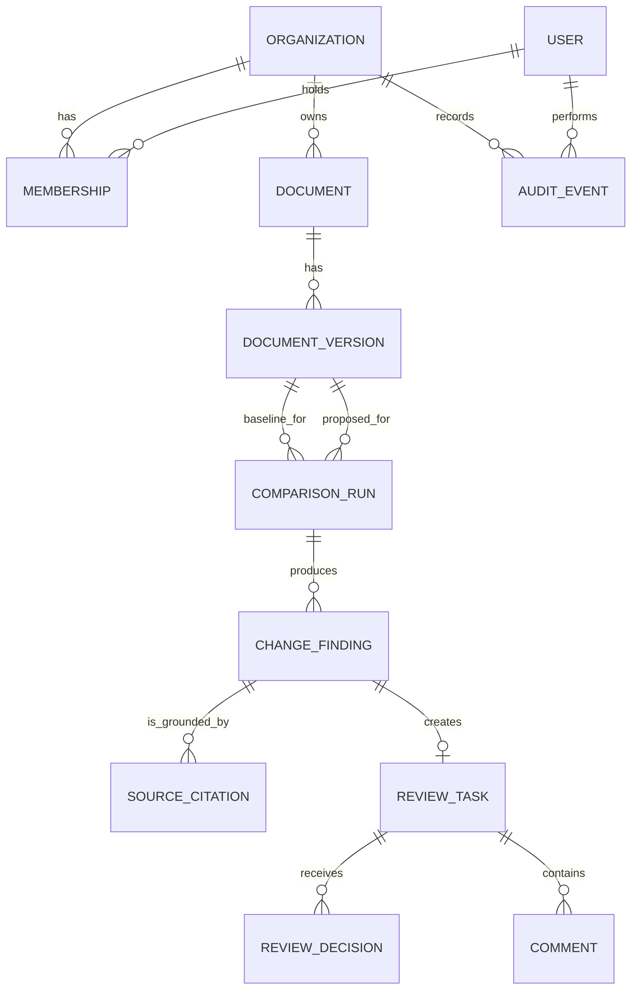
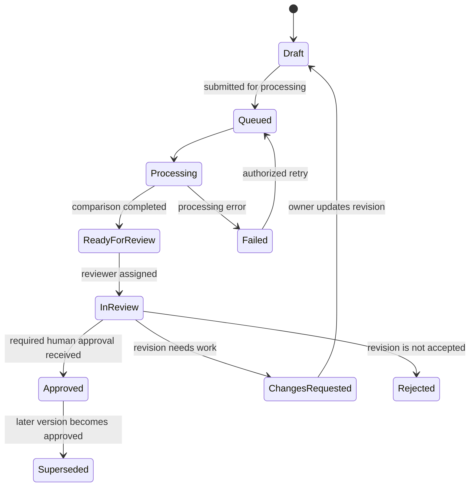
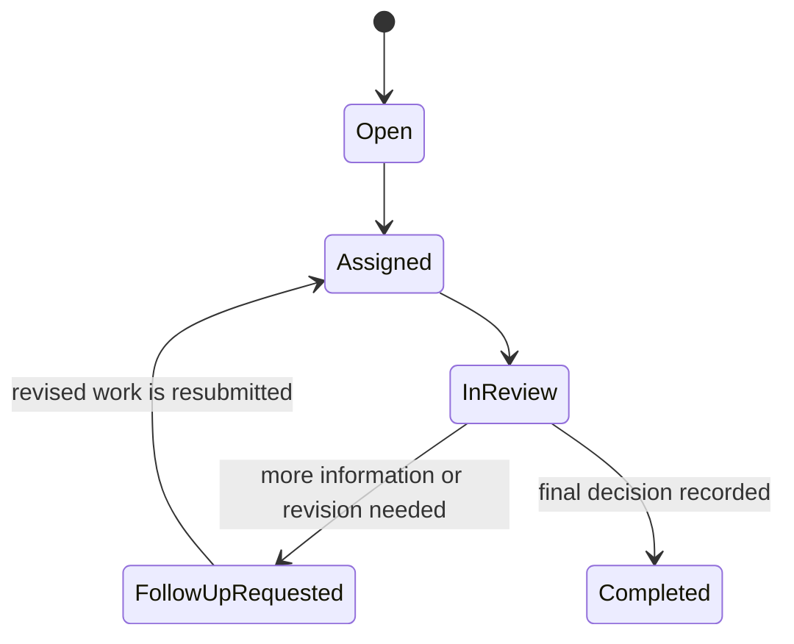

# ReviewFlow AI — Initial Domain Data Model

**Status:** Draft — Phase 0 discovery artifact  
**Last updated:** 2026-07-21  
**V1 domain:** Review of Vendor Onboarding SOP revisions

> This is a conceptual domain model, not a database schema. It defines the business concepts, relationships, lifecycle states, and invariants that the implementation must preserve. Field types, table names, Prisma models, indexes, and migrations are deliberately deferred.

## 1. Modeling approach

ReviewFlow uses names that reflect the language of its users:

- A Procurement Operations Manager manages a **Document** and submits a **Document Version**.
- A reviewer receives a **Review Task** and makes a **Review Decision**.
- The system runs a **Comparison Run** and produces candidate **Change Findings**.
- A finding is supported by one or more **Source Citations**.
- Important actions produce an **Audit Event**.

This alignment is intentional. It is commonly called **ubiquitous language** in Domain-Driven Design: developers, product stakeholders, and users should use the same words for the same business concepts.

The model avoids naming a candidate AI result `MaterialChange`, because materiality is ultimately a human judgment. `ChangeFinding` means the system found a candidate change that a reviewer can confirm, reject, or dismiss.

## 2. Entity, value object, and process-run decisions

| Concept | Conceptual role | Why it exists | Initial implementation decision |
| --- | --- | --- | --- |
| `Document` | Entity | The logical SOP that persists across revisions. | Required entity. |
| `DocumentVersion` | Entity | An immutable revision with its own status, content, and effective date. | Required entity. |
| `ComparisonRun` | Entity / process run | The same two versions may be compared more than once because of retry, changed prompts, model upgrades, or a new review attempt. | Required entity. |
| `ChangeFinding` | Entity | A candidate change has its own lifecycle, severity, reviewer, review task, and audit history. | Required entity. |
| `SourceCitation` | Value object or child entity | It proves where a finding came from: version, location, and excerpt. | Required concept; table versus JSON storage is deferred. |
| `ReviewTask` | Entity | Assigned work has an assignee, due date, lifecycle, and decisions. | Required entity. |
| `ReviewDecision` | Entity | A decision is an accountable historical event and should not be overwritten. | Required entity. |
| `AuditEvent` | Entity / append-only event | Important actions need a durable history. | Required entity. |

### Why `ComparisonRun` is needed

A comparison is not merely a calculated field on a document version. It has an independent lifecycle:

```text
Queued → Processing → Completed
                  ↘ Failed → Retried
```

It also provides a future home for the comparison method, prompt version, model/provider, latency, token usage, cost, and error details without changing the meaning of the document itself.

### Why `ChangeFinding` is needed

A comparison can produce many findings. Each finding may have a different severity, citation, reviewer, decision, and outcome. A simple `DocumentComparison` record cannot represent that independently reviewable work.

### Why `SourceCitation` is required conceptually

Source citations are part of ReviewFlow's product promise: reviewers must be able to verify an AI finding against the approved and revised SOP text.

A citation does **not** have to become a standalone database table on day one. It can initially be stored as a structured array on a `ChangeFinding` if citations are only read with their parent. It should become a child entity/table if the product needs to query, audit, annotate, or reuse citations independently.

## 3. Core entities

### Organization

The tenant boundary for organization-owned data.

**Conceptual attributes:** name, slug, settings, creation time.

### User

A person who can authenticate to ReviewFlow.

**Conceptual attributes:** identity, display name, email, account status.

### Membership

Connects a User to an Organization and defines their application permission.

**Conceptual attributes:** organization, user, role (`Owner`, `Admin`, `Reviewer`, or `Member`), membership status.

A business function such as Finance, Security, Legal, or Compliance is not automatically an application permission. A Finance Controls Manager can be a `Reviewer` in ReviewFlow.

### Document

The logical controlled procedure, for example:

```text
Vendor Onboarding and Approval Procedure
```

A Document persists across all revisions.

**Conceptual attributes:** organization, title, document type, process owner, current approved version reference.

### DocumentVersion

An immutable revision of a Document. It holds the uploaded source content and its lifecycle state.

**Conceptual attributes:** document, version label, status, source file/content reference, submitted by, effective date, approved date, supersedes version reference.

### ComparisonRun

A request to compare one baseline version with one proposed version.

**Conceptual attributes:** organization, document, baseline version, proposed version, status, initiated by, started time, completed time, failure reason, comparison metadata.

In V1, both compared versions must belong to the same Document. A future release may support cross-document comparisons only if there is a real business need.

### ChangeFinding

A candidate meaningful difference produced by a ComparisonRun.

**Conceptual attributes:** comparison run, category, severity, summary, recommendation, confidence, finding status, reviewer disposition.

Possible `finding status` values:

```text
Proposed → Confirmed
         → Dismissed
```

A finding remains `Proposed` while its assigned reviewer performs work. Review progress belongs to the related `ReviewTask`, not to the finding itself.

### SourceCitation

A structured reference that grounds a ChangeFinding in the source material.

**Conceptual attributes:** document version, location type (page, heading, paragraph, or character range), location value, excerpt, citation role (`baseline` or `revised`).

A ChangeFinding normally has at least one citation from the baseline version and one from the revised version. A deletion or new addition may have only one meaningful excerpt, so the model must permit that exception.

### ReviewTask

Human review work assigned for exactly one reviewable ChangeFinding.

**Conceptual attributes:** organization, change finding, assignee, status, priority, due date, assigned by, completed at.

#### V1 review-task decision

A reviewable ChangeFinding has **at most one ReviewTask** in V1. A raw AI candidate can have no task until it is selected for review. Once a task exists, reassignment, follow-up, and reopening update the same task and append audit events rather than creating duplicate tasks.

The current task status is stored on `ReviewTask` so reviewers can filter their work by status, assignee, priority, due date, severity, and finding category.

Possible `ReviewTask.status` values:

```text
Open
Assigned
In Review
Follow-up Requested
Completed
```

Task status describes the current workflow state. It does not say whether the reviewer accepted or rejected the proposed SOP change.

### ReviewDecision

An accountable response made during a ReviewTask.

**Conceptual attributes:** review task, decision type, decision note, decided by, decided at.

A ReviewDecision records the business outcome or an interim follow-up request. It is separate from task status so a completed task can be filtered independently from whether its result was approved, rejected, or dismissed.

Possible decision types:

```text
Approved
Rejected
Follow-up Requested
Dismissed as Not Material
```

### Comment

A discussion entry attached to a ReviewTask.

**Conceptual attributes:** review task, author, body, created time.

### AuditEvent

An append-only record of an important action.

**Conceptual attributes:** organization, actor, event type, resource type, resource identifier, occurred at, structured event metadata.

Examples include a submitted document version, completed comparison, assigned review task, recorded decision, and published approved version.

## 4. Relationships



The `ComparisonRun` has two explicit version relationships:

```text
baselineVersion: the currently approved or selected reference version
proposedVersion: the submitted version being evaluated
```

V1 review-task cardinality:

```text
ChangeFinding → zero or one ReviewTask
ReviewTask → exactly one ChangeFinding
```

A ChangeFinding has no task while it is an untriaged candidate. Once it requires human review, the system creates one task; reassignments and follow-up use that same task.

## 5. Lifecycle states

### DocumentVersion lifecycle



### ReviewTask lifecycle



A completed task's final business outcome is held by its `ReviewDecision` (`Approved`, `Rejected`, or `Dismissed as Not Material`), not by the task status.

## 6. Business invariants

These are rules the eventual API, services, database, and tests must enforce.

1. Every organization-owned resource belongs to exactly one Organization.
2. A User can belong to multiple Organizations only through separate Memberships.
3. A Document has many DocumentVersions but at most one current approved version at a time.
4. DocumentVersions are immutable once submitted for review; a correction creates a new version rather than overwriting history.
5. A ComparisonRun can compare only versions owned by the same Organization and, in V1, the same Document.
6. A ChangeFinding belongs to exactly one ComparisonRun.
7. A SourceCitation must point to a version used by its parent ComparisonRun.
8. A ChangeFinding has at most one ReviewTask, and a ReviewTask targets exactly one ChangeFinding.
9. ReviewTask status represents its current workflow state and must support organization-scoped filtering.
10. A reviewer can make a decision only on a task they are authorized to access.
11. AI output can propose a ChangeFinding but cannot approve a DocumentVersion or replace a human ReviewDecision.
12. Audit events are append-only. A correction produces a new event rather than mutating history.
13. ReviewFlow V1 does not store real vendor banking, tax, contract, or personally identifiable information in these entities.

## 7. Assumptions and open questions

| Topic | Initial assumption | Validation question |
| --- | --- | --- |
| Approvals | One assigned reviewer can decide in V1. | Which changes require parallel or sequential multi-party approval? |
| Citation storage | Citations may begin as structured child data. | Do users need citation search, annotation, or independent audit exports? |
| Current version | A Document has at most one current approved version. | Can multiple region- or department-specific approved SOP variants exist? |
| Document type | V1 supports Vendor Onboarding SOPs only. | Which domain-specific fields are needed before adding vendor policies, agreements, or RFPs? |
| AI observability | Comparison metadata belongs to ComparisonRun initially. | When is a separate AI invocation history entity justified? |

## 8. Deferred implementation decisions

The following belong to later implementation design, not this Phase 0 domain model:

- Prisma model and column names
- primary-key strategy
- relational versus JSON storage for `SourceCitation`
- database indexes and query plans
- object-storage provider and source-file format
- BullMQ queue topology and retry configuration
- model/provider adapter details
- API endpoint design
- event-bus or outbox design

## 9. Translation path

Once this model is validated, the implementation sequence is:

```text
Conceptual domain model
→ relational schema / Prisma models
→ migrations and tenant-isolation strategy
→ API contracts and authorization rules
→ worker and comparison pipeline
```
