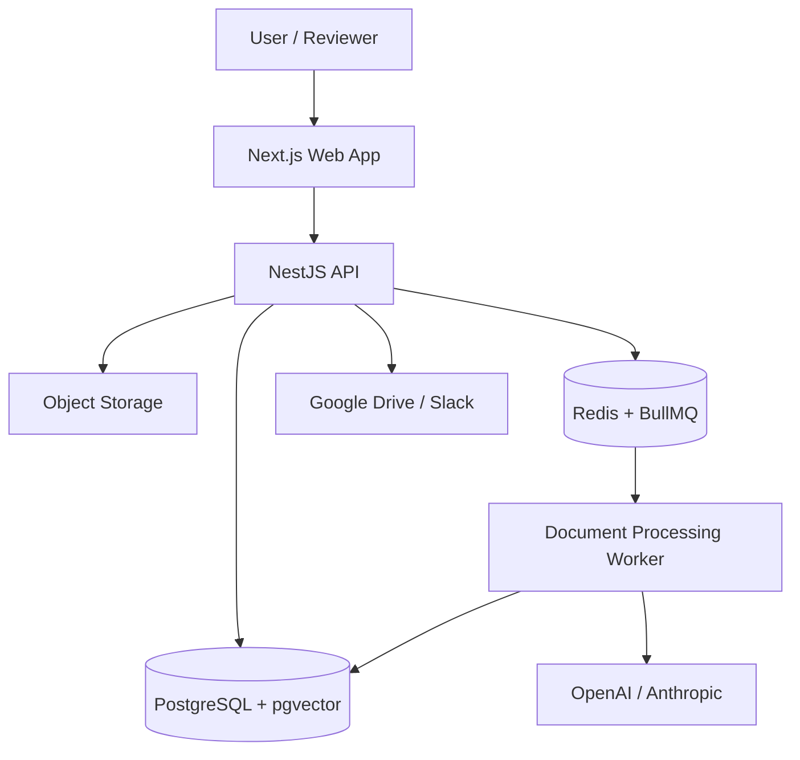

# ReviewFlow AI — Build Plan

> **Positioning goal:** Build a public, production-minded SaaS project that demonstrates senior full-stack ownership and practical AI integration. The project should prove architecture, API design, asynchronous processing, security, integrations, reliability, and product delivery—not just a chat interface.

## 1. Product Summary

**ReviewFlow AI** is a multi-tenant SaaS for teams that need to review important document changes.

A team uploads two versions of a policy, RFP, vendor agreement, SOP, technical specification, or operational document. ReviewFlow AI processes the files in the background, uses AI to identify material changes, cites the source text, assigns review tasks, and records approval decisions in an audit trail.

### Core user flow

```text
Create organization
→ Invite team members
→ Upload or import document
→ Background worker extracts and indexes content
→ Upload a revised version
→ AI identifies and classifies meaningful changes
→ Reviewer receives an assigned task
→ Reviewer approves, rejects, or requests follow-up
→ Decision and activity are retained in an audit log
```

### Target users

- Operations and procurement teams
- Agencies and consultancies
- Compliance and vendor-management teams
- Construction and project-management teams
- Companies managing policy, process, client, or supplier documents

### What makes this more than “chat with PDF”

- Version comparison instead of only document Q&A
- Source citations and structured AI results
- Human review and approval workflow
- Role-based access and audit history
- Background processing, retries, and failure states
- External document sync and notifications
- AI model, prompt, cost, latency, and evaluation visibility

---

## 2. Portfolio Story

Use this project description on GitHub, your portfolio, and eventually your résumé:

> Built a multi-tenant AI document-review SaaS that processes documents asynchronously, detects material changes using structured LLM outputs, routes human review through RBAC workflows, and provides source citations, audit logs, provider fallbacks, evaluation tooling, and observability.

Only use this wording after the listed capabilities are actually implemented.

---

## 3. Recommended Architecture

```text
reviewflow-ai/
├── apps/
│   ├── web/                  # Next.js dashboard
│   ├── api/                  # NestJS API
│   └── worker/               # BullMQ background processors
├── packages/
│   ├── shared/               # Zod schemas, domain types, utilities
│   └── ui/                   # Shared UI primitives, if needed
├── docs/
│   ├── architecture.md
│   ├── api.md
│   ├── threat-model.md
│   ├── evaluation-strategy.md
│   └── decisions/            # Architecture decision records (ADRs)
├── docker-compose.yml
└── README.md
```

### Main service flow



---

## 4. Technology Stack

| Area | Recommended technology | What it demonstrates |
|---|---|---|
| Frontend | Next.js, React, TypeScript, Tailwind CSS, shadcn/ui | Product UI architecture, accessible interfaces, typed frontend development |
| API | NestJS, TypeScript, REST API, OpenAPI/Swagger | Backend architecture, API design, validation, modular services |
| Data | PostgreSQL, Prisma, pgvector | Relational modeling, migrations, tenant isolation, semantic retrieval |
| Async work | Redis, BullMQ | Queues, retries, idempotency, background jobs, processing states |
| Storage | AWS S3 in production; MinIO locally | Secure uploads, signed URLs, object lifecycle handling |
| AI | OpenAI and Anthropic provider adapters, Zod schemas | Structured AI output, provider abstraction, validation, fallback handling |
| Integration | Google Drive OAuth; Slack webhook or OAuth app | OAuth, sync jobs, third-party APIs, notifications |
| Security | Authentication, RBAC, audit logs, rate limiting, signed URLs | Production-minded data and access controls |
| Quality | Vitest/Jest, Supertest, Playwright | Unit, API, and end-to-end testing |
| Delivery | Docker Compose, GitHub Actions, Vercel + Railway/Render/Fly.io | Reproducible environments, CI/CD, deployment ownership |
| Observability | Sentry and/or OpenTelemetry | Error tracking, traces, job health, production debugging |

> Keep the first version focused. Do not introduce every tool on day one; add technology only when a project requirement justifies it.

---

## 5. Phased Build Plan

## Phase 0 — Discovery, Design, and Project Foundations

### Goal

Define a narrow workflow and make architectural choices before building UI pages.

### Features and deliverables

- [ ] Define one initial document domain, such as vendor policies, RFPs, or operational SOPs.
- [ ] Write three primary user stories: administrator, reviewer, and organization member.
- [ ] Create a small set of realistic but non-confidential sample documents.
- [ ] Design the initial data model: organizations, memberships, documents, versions, extracted changes, review tasks, comments, and audit events.
- [ ] Create basic wireframes for dashboard, upload, comparison, and review screens.
- [ ] Create an architecture diagram.
- [ ] Design the main API endpoints before coding (resources, routes, methods, request/response shapes).
- [ ] Define error strategy (how errors flow through the system: error types, status codes, structured error responses, service vs controller error handling).
- [ ] Define testing approach (what to unit test vs integration test vs E2E test; test pyramid for this project).
- [ ] Add initial ADRs:
  - [ ] Why Next.js + NestJS
  - [ ] Why PostgreSQL + pgvector
  - [ ] Why Redis + BullMQ for processing
  - [ ] Why structured AI outputs need Zod validation
- [ ] Set up monorepo, linting, formatting, type checking, pre-commit hooks, and CI.

### Senior signals shown

- Product scoping and technical strategy
- Domain modeling and architecture planning
- Clear trade-off documentation
- Quality standards before feature development

### Definition of done

A reviewer can understand the problem, system boundary, data model, and main workflow from the repository without running the app.

---

## Phase 1 — SaaS Foundation: Authentication, Organizations, and RBAC

### Goal

Build the multi-tenant foundation before implementing AI features.

### Features

- [ ] Sign up, sign in, sign out, and password/session management.
- [ ] Create an organization and organization workspace.
- [ ] Invite team members.
- [ ] Implement roles:
  - [ ] Owner
  - [ ] Admin
  - [ ] Reviewer
  - [ ] Member
- [ ] Enforce organization-scoped database queries.
- [ ] Build a basic dashboard showing documents, review tasks, and activity.
- [ ] Create an audit event whenever a privileged action occurs.
- [ ] Publish OpenAPI documentation for organization and membership endpoints.

### Senior signals shown

- Multi-tenant SaaS data modeling
- API boundaries and authorization design
- RBAC and tenant isolation
- Auditability and secure access patterns

### Definition of done

Two organizations can use the product without reading or modifying each other’s data. Each role has an explicit set of permitted actions.

---

## Phase 2 — Secure Document Ingestion and Background Processing

### Goal

Make document intake reliable, observable, and asynchronous.

### Features

- [ ] Upload PDF documents to object storage using signed URLs.
- [ ] Validate file type, size, and basic content signature before accepting a file.
- [ ] Create document states:

```text
Uploaded → Queued → Processing → Ready → Failed
```

- [ ] Add a BullMQ queue for document-processing jobs.
- [ ] Build worker logic to extract text, metadata, page count, and document sections.
- [ ] Store processing results and status in PostgreSQL.
- [ ] Implement retries with bounded retry attempts and meaningful error messages.
- [ ] Make processing idempotent so retries do not duplicate results.
- [ ] Add a document-processing status screen with retry support for authorized users.
- [ ] Write tests for successful, failed, and retried processing jobs.

### Senior signals shown

- Redis queues and background workers
- Async state machines and idempotency
- File storage, signed URLs, and validation
- Error recovery and operational visibility
- Backend testing and failure-mode design

### Definition of done

A user can upload a sample document, see the processing state update, and recover from a simulated worker failure without corrupting data.

---

## Phase 3 — AI Change Intelligence and Cited Results

### Goal

Use AI to produce reliable, structured, reviewable outputs instead of unverified chat responses.

### Features

- [ ] Support uploading a new version of an existing document.
- [ ] Segment documents into page-aware chunks.
- [ ] Generate embeddings and store them using pgvector.
- [ ] Compare document versions and identify meaningful changes.
- [ ] Return structured change objects, for example:

```json
{
  "changeType": "Payment Terms",
  "severity": "high",
  "summary": "Payment window changed from 30 to 60 days.",
  "sourceReferences": [
    {
      "page": 4,
      "excerpt": "Payment shall be made within sixty (60) days..."
    }
  ],
  "recommendedAction": "Finance review required"
}
```

- [ ] Validate every AI response using Zod.
- [ ] Build a provider interface for OpenAI and Anthropic.
- [ ] Implement provider fallback for transient failures.
- [ ] Record model, prompt version, input/output token usage, latency, estimated cost, and error details.
- [ ] Show document changes with source citations in the UI.
- [ ] Add confidence thresholds that send uncertain outputs to manual review.

### Senior signals shown

- Production AI integration rather than a generic chatbot
- Structured outputs and schema validation
- Provider abstraction, fallbacks, and cost visibility
- RAG/semantic retrieval and source citations
- Human-in-the-loop safety controls

### Definition of done

A reviewer can upload two sample document versions, see structured change results with source citations, and identify whether an output came from the primary or fallback AI provider.

---

## Phase 4 — Human Review, Approvals, and Audit Workflow

### Goal

Turn AI output into a business workflow that teams can trust.

### Features

- [ ] Create review tasks from AI-detected changes.
- [ ] Assign a reviewer and due date.
- [ ] Support approve, reject, dismiss, and request-follow-up decisions.
- [ ] Add comments and reviewer notes.
- [ ] Keep a permanent audit history for document, task, and decision changes.
- [ ] Build dashboard filters for status, severity, assigned reviewer, and due date.
- [ ] Add in-app notifications for assignment and decision events.
- [ ] Add email notifications if time permits.

### Senior signals shown

- Product workflow design
- State transitions and business rules
- Auditability and data history
- Cross-functional, human-in-the-loop AI design
- Complex frontend state and filtering

### Definition of done

An AI-detected change can become a review task, be assigned, receive a decision, and display a complete activity timeline.

---

## Phase 5 — External Integration: Google Drive and Slack

### Goal

Demonstrate real-world integration and sync reliability.

### Features

#### Google Drive

- [ ] Connect a Google account with OAuth.
- [ ] Allow a user to select a Drive folder.
- [ ] Import selected documents into an organization workspace.
- [ ] Queue imported documents for processing.
- [ ] Show sync state, last successful sync, and errors.
- [ ] Support reconnecting an expired or revoked account.

#### Slack

- [ ] Send a Slack notification for high-severity changes.
- [ ] Notify reviewers when tasks are assigned or due soon.
- [ ] Include an actionable link back to the review task.

### Senior signals shown

- OAuth and token lifecycle handling
- Third-party API integration
- Sync jobs, retries, reconciliation, and error states
- Webhooks/notifications and integration observability

### Definition of done

A user can connect Google Drive, import a document, track its processing status, and receive a Slack notification for an assigned high-severity review task.

---

## Phase 6 — Reliability, Performance, Security, and AI Evaluation

### Goal

Add the production-quality details that differentiate a staff-minded project from a feature demo.

### Features

#### Reliability and performance

- [ ] Add Redis caching for safe, frequently read data such as organization settings or document summaries.
- [ ] Document cache keys, TTLs, and invalidation strategy.
- [ ] Add rate limiting to expensive AI and upload endpoints.
- [ ] Add health and readiness endpoints.
- [ ] Add pagination, filtering, and query optimization for large document/task lists.
- [ ] Add structured logging with request and job correlation IDs.

#### Security

- [ ] Document threat model for tenant isolation, uploads, OAuth tokens, and AI data handling.
- [ ] Use signed URLs and private object storage.
- [ ] Enforce authorization at API and service layers.
- [ ] Protect against cross-tenant document access.
- [ ] Store provider tokens and secrets safely.

#### AI evaluation

- [ ] Build a small evaluation dataset of document pairs and expected changes.
- [ ] Run evaluations against prompt and model versions.
- [ ] Record extraction accuracy, citation completeness, schema-validation failures, cost, and latency.
- [ ] Prevent regressions when changing prompts or provider configuration.

### Senior signals shown

- Caching and cache invalidation
- Rate limiting and performance engineering
- Security and threat modeling
- Observability and incident-readiness thinking
- AI evaluation and regression prevention

### Definition of done

The repository documents how the system handles queue failures, caching, authorization, model changes, prompt regressions, and high-cost AI requests.

---

## Phase 7 — Portfolio Packaging and Launch

### Goal

Make the project easy for a recruiter, hiring manager, or technical interviewer to evaluate in under five minutes.

### Features and deliverables

- [ ] Deploy web, API, worker, database, Redis, and storage configuration.
- [ ] Add seeded demo data and a safe demo account.
- [ ] Record a 60–90 second demo video.
- [ ] Add screenshots or GIFs for the main workflow.
- [ ] Write a high-quality README with:
  - [ ] Problem statement
  - [ ] Architecture diagram
  - [ ] Stack and engineering decisions
  - [ ] Setup instructions
  - [ ] Security model
  - [ ] Queue/retry design
  - [ ] AI provider and evaluation strategy
  - [ ] Test strategy
  - [ ] Live demo link
- [ ] Add a short architecture case study to your portfolio website.
- [ ] Pin the repository above `rfi-zero` on your GitHub profile.

### Senior signals shown

- End-to-end ownership
- Technical communication
- Deployment and production support
- Ability to explain architectural trade-offs clearly

### Definition of done

A recruiter can open the repository, understand the product and architecture, run it locally, review the code and tests, and try a deployed demo without asking for clarification.

---

## 6. Evidence Map: What the Project Proves

| Recruiter concern | Proof in ReviewFlow AI |
|---|---|
| Can this person build a product end to end? | Next.js UI, NestJS API, worker, database, deployment, documentation |
| Can this person design backend systems? | API boundaries, data model, multi-tenancy, RBAC, queue architecture |
| Can this person build reliable AI features? | Structured outputs, Zod validation, citations, fallback, evaluations, human review |
| Can this person handle scale and failures? | Redis queue, retries, idempotency, job status, rate limiting, health checks |
| Can this person integrate external systems? | Google Drive OAuth, Slack notifications, sync/reconnect flow |
| Can this person build secure SaaS? | Tenant isolation, RBAC, signed URLs, audit logs, threat model |
| Can this person communicate at senior/staff level? | ADRs, architecture diagram, runbook, API docs, test strategy |

---

## 7. Must-Have vs Stretch Features

### Must-have before launch

- Multi-tenant organizations and RBAC
- Secure document upload
- Background processing queue with retry state
- Document version comparison
- Structured AI change detection with citations
- Human review task workflow
- Audit log
- Deployed demo
- README, architecture diagram, and tests

### Stretch features

- Google Drive automatic folder sync
- Slack notifications
- Anthropic fallback provider
- Full evaluation dashboard
- Billing and subscription management
- Real-time collaboration
- DOCX/PDF proposal export
- Advanced analytics

> Finish the must-have version before adding stretch features. A smaller deployed project with clear architecture is much more valuable than an unfinished feature-heavy project.

---

## 8. Metrics to Collect After Launch

Do not invent résumé metrics. Instrument the product and collect real data.

- Document-processing success and failure rate
- Queue latency and retry count
- Median document-processing time
- AI response latency
- Schema-validation failure rate
- AI provider fallback rate
- Token usage and estimated cost per document
- Citation completeness on evaluation data
- Review-task completion time
- Number of documents, organizations, or users in demo/real usage

Possible future résumé wording, only after implementation and measurement:

> Built a multi-tenant AI document-review SaaS with asynchronous processing, structured LLM outputs, human approval workflows, and cited change detection; instrumented queue health, provider fallback, AI latency, and cost telemetry.

---

## 9. Rules for a Credible Portfolio Project

- Do not copy confidential employer code, workflows, data, or documents.
- Use public or synthetic sample files.
- Do not claim users, revenue, performance, or uptime you cannot measure.
- Keep all secrets out of Git and provide `.env.example`.
- Explain trade-offs honestly in ADRs.
- Prefer a finished demo over a large unfinished feature list.
- Make meaningful commits with clear messages as the product evolves.
